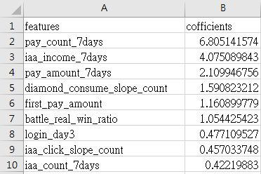

# Game-Revenue-Prediction
預測每週玩家的180日累積儲值金額，以利行銷跟營運決策

Predict the 180-day cumulative revenue of weekly players to support marketing and operational decisions.

### 專案簡介 | Project Overview
本專案使用遊戲玩家前 7 天的行為資訊來預測 180 天的累積儲值金額，並比較三種模型（LASSO、LightGBM 和 XGBoost）的預測成效。
最終選擇 LASSO 模型以滾動式的方式進行每月最新玩家行為的預測，並達成中位數百分比誤差約 9% 的準確度。

This project leverages the first 7 days of player behavior data to predict 180-day cumulative revenue. Three models—LASSO, LightGBM, and XGBoost—are compared, with LASSO selected for its accuracy and reliability. 
Rolling monthly predictions achieve a median percentage error of approximately 9%.

---

### 主要目的 | Main Purpose
每週行銷成本是否回本，以及營運策略的調整是否能有效提升玩家的儲值行為。

To evaluate whether weekly marketing costs yield a return on investment and assess the impact of operational strategies on player spending behavior.

---

### 輸出結果 | Output Results
1. **model.pkl**
   已訓練完成的模型，可透過 predict.py 進行預測，也可以在 MLFlow 上建立備份（檔案未包含，因模型屬於敏感資料）。

   The trained model file, used for predictions via predict.py. It can also be backed up on MLFlow (not included in GitHub due to sensitivity concerns).
3. **encoders.pkl**
   用於將類別數據轉換為數值的編碼標準，基於訓練數據生成，供測試數據的類別數據轉換使用。

   Encoders for converting categorical data into numerical values. These are generated from training data and applied to transform categorical data in testing.
5. **features.csv**  
   列出各特徵的重要性，能直觀呈現對模型影響較大的特徵。

   Lists feature importance, providing a clear view of which features have the most significant impact on the model.

   

---

### 各檔案描述 | File Descriptions
- **data_processing.py**  
  玩家遊戲行為資料前處理，包含類別、整合及每日數據，並新增斜率特徵，用於觀察玩家遊戲行為隨時間變化的趨勢（如熱情增加或減少的指標）

  Handles preprocessing of player behavior data, including categorical conversion, data integration, and generating daily metrics.
  It also creates slope-based features to observe trends such as increased or decreased engagement over time.
- **insert_data.py**  
  更新過去 180 天內的新玩家行為數據，並寫入 MySQL 資料庫，提升後續模型訓練與測試的效率。

  Updates and inserts new player behavior data from the past 180 days into a MySQL database, improving the efficiency of future model training and testing.
- **modeling.py**  
  - 將類別資訊轉換為數值，並匯出 encoders.pkl 供後續測試資料使用。
  
    Converts categorical data to numerical values and exports encoders.pkl for use with test data.
  - 使用交叉驗證（CV）尋找 LASSO 模型的最佳化參數。
  
    Finds optimal parameters for the LASSO model using cross-validation (CV).
  - 紀錄 LASSO 模型的交叉驗證結果
  
    Records LASSO model cross-validation results.
  - 將訓練結果、參數與模型上傳至 MLflow
  
    Uploads training results, parameters, and the model to MLflow.
- **predit.py**
  使用預測數據（CSV 格式）與訓練好的模型（PKL 格式），進行預測並輸出處理後的結果
  Utilizes prediction data (in CSV format) and a trained model (in PKL format) to generate predictions and process the output results.
- **lgbm_test.py 、 xgboost_test.py**

  驗證 LightGBM 跟 XGBoost 模型，包含以下步驟：
  - 驗證 min-max 正規化與 log 轉換的效果。
  - 將類別數據轉換為數值。
  - 使用 Optuna 尋找最佳化參數組合。
  - 評估模型的特徵重要性。
  
  Validates LightGBM and XGBoost model, including:
  - Testing the effectiveness of min-max normalization and log transformation.
  - Converting categorical data into numerical values.
  - Using Optuna to find the optimal parameter set.
  - Assessing feature importance for the model.
